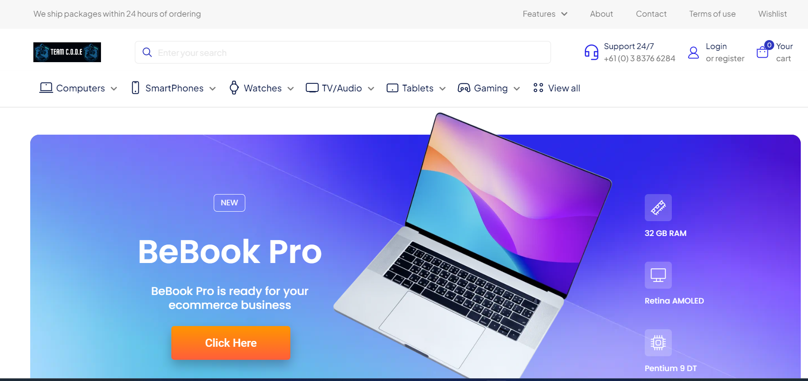
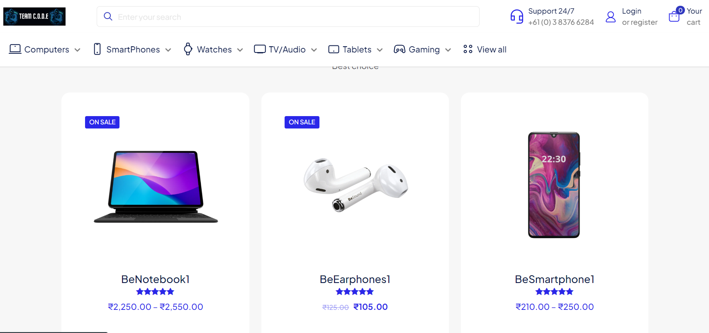
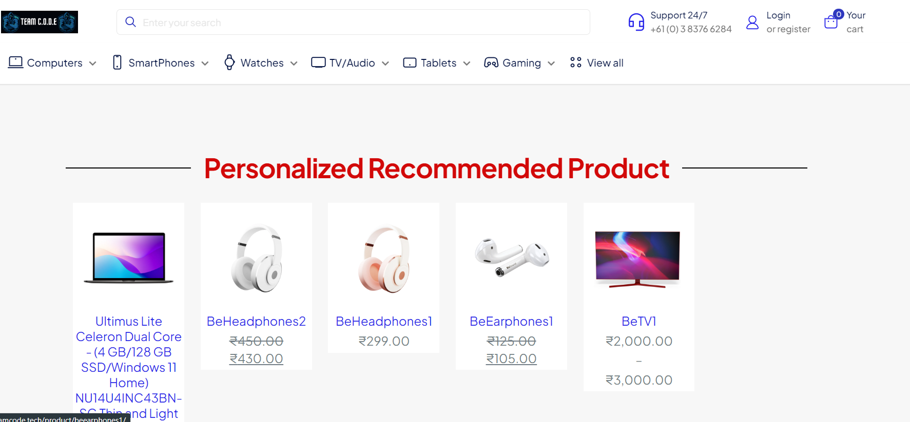
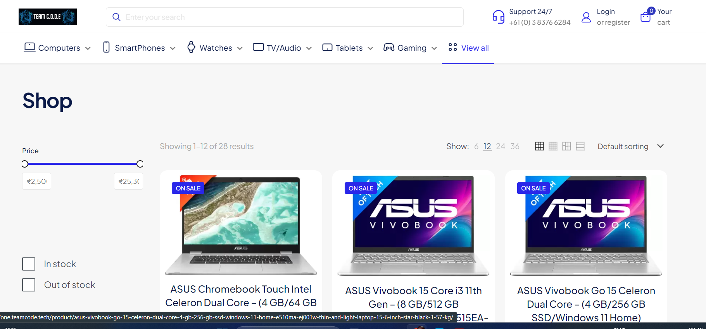
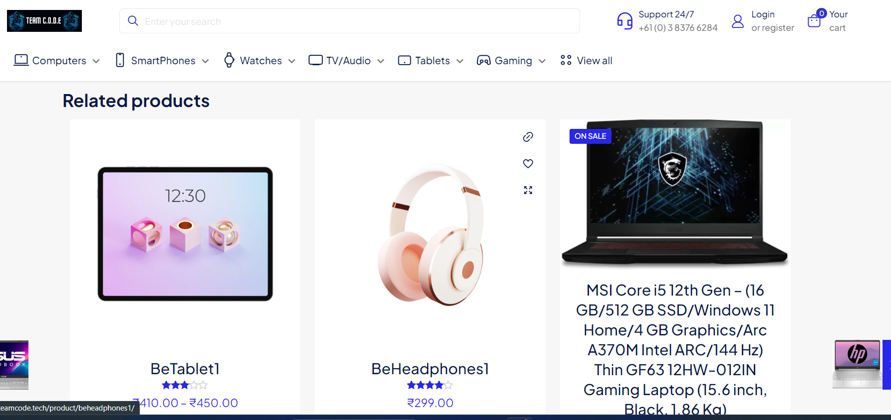

# Flipkart Grid 5.0
A Eccomerce site which recommend Personalized Product on the basis of user preferences, past interactions, product popularity, and user similarity.

## Overview

In this project, We, Team CODE aims to analyze a dataset of over 1,000 products listed on Flipkart and build a recommendation system to suggest products to users based on their interests and previous purchases. 
The project encompasses data collection, data preparation, exploratory data analysis (EDA), data visualization, and the development of a simple recommendation system using machine learning techniques.

## Problem Statement :
In an effort to enhance customer engagement, satisfaction, and revenue growth, we aim to develop a personalized product recommendation system for Flipkart, a prominent e-commerce platform. 
The objective is to leverage machine learning algorithms to suggest relevant products to users based on their interests and previous purchase behavior. 
By creating a system that effectively understands user preferences and provides tailored recommendations, we seek to improve customer engagement, increase sales conversion rates, and optimize product offerings.

## Background and Motivation:
In the rapidly evolving e-commerce landscape, understanding customer preferences and providing personalized experiences are critical to maintaining a competitive edge. Traditional one-size-fits-all approaches often fall short in catering to the diverse needs and interests of customers.
By developing a recommendation system that analyzes user interactions, product attributes, and historical purchases, we aim to create a solution that addresses these challenges and enhances the user experience on Flipkart.

## Objectives :  	:notebook_with_decorative_cover:
- Create a recommendation system that suggests products to users based on their interests and previous purchase behavior.
- Analyze user interactions and purchase history to establish user profiles.
- Identify user preferences, category affinities, and purchase patterns.
- Implement collaborative filtering and content-based filtering algorithms for personalized recommendations.
- Leverage collaborative filtering to identify similar users and suggest products.
- Utilize content-based filtering to recommend products based on attributes and preferences.

# Solution  	:key:

## Product 
1. AI Model - An model which helps in recommendation for products on the basis of user preferences, past interactions, product popularity, and user similarity.
2. Eccomerce Website:- An Eccomerce website where we will recommend Personalized products to different users using ml model.

## Features :  	:notebook_with_decorative_cover:
1. User Profiling
2. Content-Based Filtering
3. Hybrid Recommendations
4. Real-time Updates
5. Personalized Suggestions
6. Similar Product Recommendations
7. Popular Products
8. User-Friendly Interface

## Tools and Technology Used:

## Business Model / StartUp Potential  	:moneybag:

Our business model centers around enhancing user experiences and driving sales through a sophisticated personalized product recommendation system. By leveraging user interactions, preferences, and historical data, we develop cutting-edge recommendation algorithms that provide users with tailored product suggestions. Our platform benefits both online shoppers seeking convenience and e-commerce platforms aiming to elevate their user engagement.

We generate revenue through multiple streams, including a transaction-based model where we earn a percentage of sales from recommended products. Additionally, we offer a subscription tier that provides premium personalization and exclusive recommendations. Our ability to analyze user behavior and trends positions us to monetize data insights by partnering with third-party companies looking for valuable market insights.

### ScreenShots of FlipGrid
<pre>
     
</pre>
### Contributors
- Shashank Kumar
- Aman Gupta
- Shubhi Singh

Built with ❤️ by Team C.O.D.E

